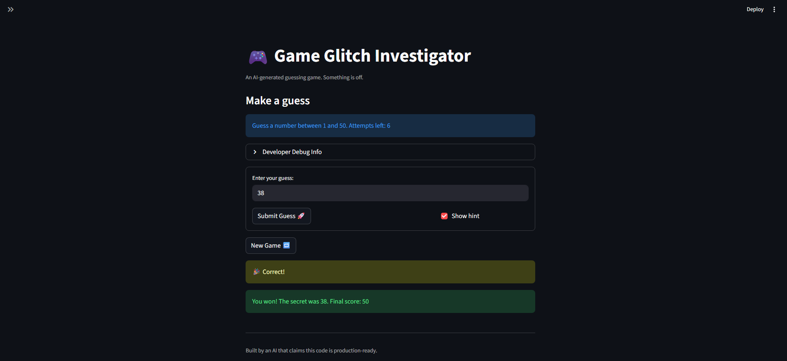

# 🎮 Game Glitch Investigator: The Impossible Guesser

## 🚨 The Situation

You asked an AI to build a simple "Number Guessing Game" using Streamlit.
It wrote the code, ran away, and now the game is unplayable.

- You can't win.
- The hints lie to you.
- The secret number seems to have commitment issues.

## 🛠️ Setup

1. Install dependencies: `pip install -r requirements.txt`
2. Run the broken app: `python -m streamlit run app.py`

## 🕵️‍♂️ Your Mission

1. **Play the game.** Open the "Developer Debug Info" tab to see the secret number. Try to win.
2. **Find the State Bug.** Why does the secret number change every time you click "Submit"? Ask ChatGPT: *"How do I keep a variable from resetting in Streamlit when I click a button?"*
3. **Fix the Logic.** The hints ("Higher/Lower") are wrong. Fix them.
4. **Refactor & Test.**
   - Move the logic into `logic_utils.py`
   - Run `pytest` in your terminal
   - Keep fixing until all tests pass!

## 📝 Document Your Experience

- [x] **Describe the game's purpose.**

  A number guessing game where the player tries to guess a secret number. After each guess, the app gives a "Higher" or "Lower" hint and tracks remaining attempts. The goal is to guess correctly before running out.

- [x] **Detail which bugs you found.**

  - **Reversed hints:** "Go HIGHER" and "Go LOWER" were swapped.
  - **Attempts tracking:** Attempts only incremented every other guess; history updated with a delay.
  - **New Game didn't reset:** History, secret number, and attempts all persisted after clicking New Game.
  - **Inconsistent difficulty ranges:** Hard mode was actually easier than Normal; switching difficulty didn't regenerate the secret.
  - **Secret reset on every submit:** Clicking "Submit" re-ran the script and picked a new secret each time.
  - **Enter key didn't submit:** Users had to click the button manually.

- [x] **Explain what fixes you applied.**

  - Corrected the `check_guess` feedback logic so hints reflect the actual guess vs. secret.
  - Moved all game logic into `logic_utils.py` for modularity.
  - Fixed attempts tracking to increment on every guess with immediate history updates.
  - Updated New Game to fully reset secret, attempts, and history without a page refresh.
  - Rebalanced difficulty ranges:

    | Difficulty | Range  | Attempts |
    |------------|--------|----------|
    | Easy       | 1–20   | 6        |
    | Normal     | 1–50   | 8        |
    | Hard       | 1–100  | 5        |

  - Switching difficulty now auto-resets the game with a valid secret in the new range.
  - Wrapped guess input in `st.form` to enable Enter key submission.
  - Fixed type comparison bugs so guess vs. secret is always integer-to-integer.
  - Ensured score updates correctly and consistently after every guess.

## 📸 Demo

- [ ] *[Insert a screenshot of your fixed, winning game here]*

## 🚀 Stretch Features

- [ ] *[If you completed Challenge 4, insert a screenshot of your Enhanced Game UI here]*